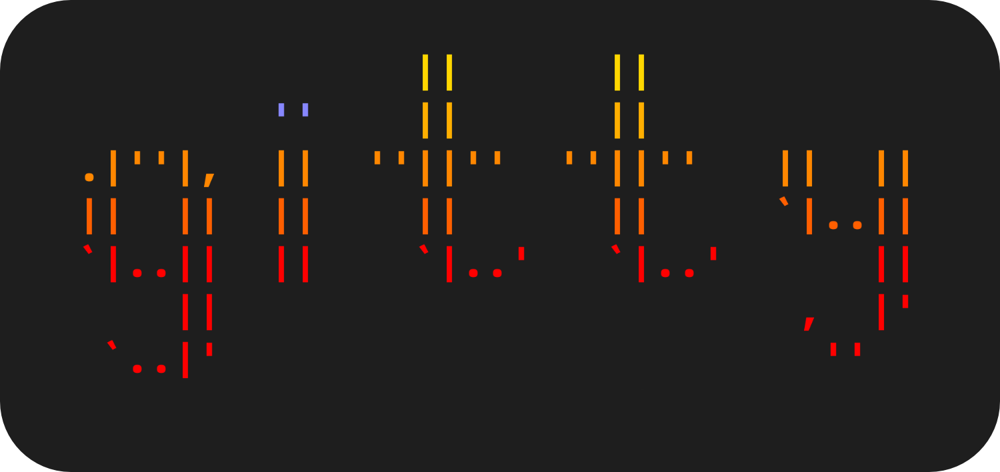
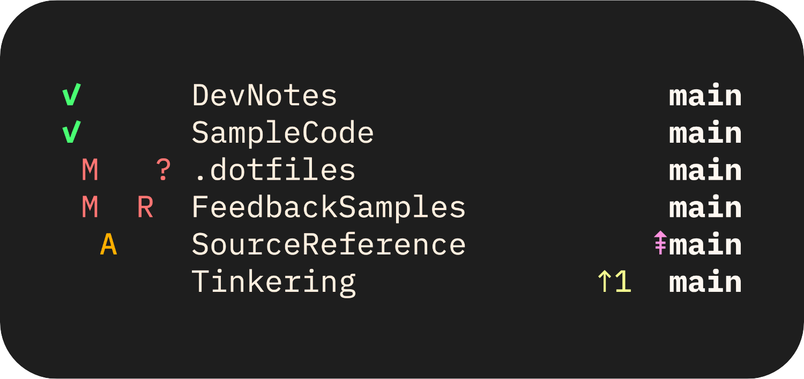

<!--
SPDX-FileCopyrightText: © 2024 Andrii Sem
SPDX-License-Identifier: MIT
-->

<p align="center">
    
    
</p>

<p align="center">
   Customizable status line tool for multiple Git repos
</p>

*Inspired by [mgitstatus](https://github.com/fboender/multi-git-status)*

## Feature Highlights

- Manage the list of Git repos. (see [`List Subcommand`](https://andrsem.github.io/gitty/web/gitty.html#list-subcommand))
- Show the status of managed Git repos. (see [`Status Subcommand`](https://andrsem.github.io/gitty/web/gitty.html#status-sub))
- Execute aliases or shell commands on managed repos. (see [`Run Subcommand`](https://andrsem.github.io/gitty/web/gitty.html#run-sub))
    - Choose status filters to decide when to execute aliases or shell commands.
    - Create aliases for frequently used commands. (see [`Aliases Configuration`](https://andrsem.github.io/gitty/web/gitty-config.html#_aliases))
- Filter repos by tags or by path pattern.
- Create new layouts. Choose and style status components, or create custom ones. (see [`Layout Configuration`](https://andrsem.github.io/gitty/web/gitty-config.html#_layout))

## Quick Start

```sh
# Find and add Git repos to the list starting at home directory
gitty list --scan-add ~

# Show the status of all managed repos
gitty

# Show help
gitty --help
```

## Documentation

- gitty cli documentation can be found at [gitty(1)](https://andrsem.github.io/gitty/web/gitty.html) or by using `man gitty`
- gitty configuration documentation can be found at [gitty-config(5)](https://andrsem.github.io/gitty/web/gitty-config.html) or by using `man gitty-config`

## Installation

Gitty depends on Swift 6.2 or later. The information about how to install Swift can be found at <https://www.swift.org/install>

### Building from Source

1. **Clone and build**

   ```sh
   git clone https://github.com/andrsem/gitty.git ~/Downloads/gitty
   cd ~/Downloads/gitty
   swift build -c release
   ```

2. **Install**

   ```sh
   sudo install .build/release/gitty /usr/local/bin/
   ```

3. **Verify the installation**

   ```sh
   gitty --version
   ```

### Man Pages

<details>
<summary>Installing Man Pages</summary>

1. **Clone**

   ```sh
   git clone https://github.com/andrsem/gitty.git ~/Downloads/gitty
   cd ~/Downloads/gitty
   ```

2. **Install**

   Install in default location: /usr/local/share/man
   ```sh
   MANPATH=/usr/local/share/man
   sudo mkdir -p $MANPATH/man1 $MANPATH/man5
   sudo install docs/man/gitty.1 $MANPATH/man1/
   sudo install docs/man/gitty-config.5 $MANPATH/man5/
   ```

</details>

### Completions

<details>
<summary>Installing Zsh Completions</summary>
<br>

If you have [`oh-my-zsh`](https://ohmyz.sh) installed, you already have a directory of automatically loading completion scripts — `.oh-my-zsh/completions`. Copy your new completion script to that directory.

```sh
gitty --generate-completion-script zsh > ~/.oh-my-zsh/completions/_gitty
```

> Your completion script must have the following filename format: `_gitty`

Without `oh-my-zsh`, you'll need to add a path for completion scripts to your function path and turn on completion script autoloading. First, add these lines to `~/.zshrc`:

```sh
fpath=(~/.zsh/completion $fpath)
autoload -U compinit
compinit
```

Next, create a directory at `~/.zsh/completion` and copy the completion script to the new directory.

</details>

<details>
<summary>Installing Bash Completions</summary>
<br>

If you have [`bash-completion`](https://github.com/scop/bash-completion) installed, you can just copy your new completion script to the `/usr/local/etc/bash_completion.d` directory.

```sh
gitty --generate-completion-script bash > /usr/local/etc/bash_completion.d/gitty.bash
```

Without `bash-completion`, you'll need to source the completion script directly. Copy it to a directory such as `~/.bash_completions/`, and then add the following line to `~/.bash_profile` or `~/.bashrc`:

```sh
source ~/.bash_completions/gitty.bash
```

</details>

<details>
<summary>Installing Fish Completions</summary>
<br>

Copy the completion script to any path listed in the environment variable `$fish_completion_path`. For example, a typical location is `~/.config/fish/completions/gitty.fish`.

```sh
gitty --generate-completion-script fish > ~/.config/fish/completions/gitty.fish
```

</details>


## Future Directions

As of version 1.0, I'm considering the gitty project finished. The main focus after 1.0 would be fixing oversights on my part.

The long-term vision is to keep gitty simple, focused, and working like a dream. Reimplementing Git or implementing every Git feature is not a goal of this project. For advanced usages, consider using Git directly or something like amazing [lazygit](https://github.com/jesseduffield/lazygit).
